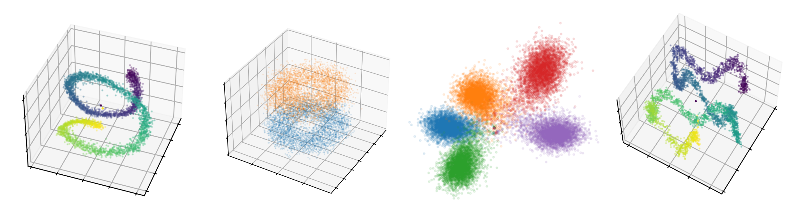

# multilingual-geometry
Code for the paper [The Geometry of Multilingual Language Model Representations](https://arxiv.org/abs/2205.10964) (2022).
Includes code for identifying affine language subspaces in multilingual language models, evaluating perplexities when representations are projected onto language subspaces, computing subspace distances, and visualizing representations projected onto various axes and subspaces.

Visualizations require only steps 0 and 3 below.
For more detailed usage, see comments in the individual Python scripts.
Run on Python 3.7.9 (see requirements.txt).
Sample usage is provided online in the Google Colab notebook [here](https://colab.research.google.com/drive/1DxEi6_gg3WLaUWwz61-JQ7iwykyN1hud?usp=sharing).

## 0. Get tokenized sequences from the OSCAR corpus.
This step is necessary for any of the sections below.
First, pull raw text data from the OSCAR corpus.
This outputs a text file for each language.
To access the data, you may have to create a Hugging Face account, activate the dataset [here](https://huggingface.co/datasets/oscar-corpus/OSCAR-2109), install the transformers library, and log in with the command "huggingface-cli login" first.
<pre>
python3 scripts/get_text_data.py --dataset="oscar" --output_dir="../oscar_data" \
--max_examples=128000000
</pre>
Tokenize the examples.
This outputs a text file for each language, where each line is a space-separated list of token ids.
<pre>
python3 scripts/tokenize_examples.py --tokenizer="xlm-roberta-base" \
--input_dir="../oscar_data" --output_dir="../oscar_xlmr_tokenized" \
--max_examples=8000000 --max_segments=-1 --max_seq_len=512
</pre>

## 1. Compute language subspaces and evaluate projected language modeling perplexities.
For each language, create two subsets of 512 examples (one for subspace computation, and one for language modeling evaluation).
This outputs a pickle file for each language.
<pre>
python3 scripts/subset_examples.py --input_dir="../oscar_xlmr_tokenized" \
--output_dir="../oscar_xlmr_tokenized_subsets/512_examples" \
--max_examples=512 --num_subsets=2
</pre>
Run perplexity evaluations when the model is projected into each language subspace.
This automatically computes and caches the language subspaces.
By default (along with unprojected perplexities), it runs evaluation for each language A projecting onto the language A subspace using the formula V_{A}V_{A}^T(x - \mu_{A}) + \mu_{A}.
Other projections can be selected manually by updating EVAL_TUPLES in eval_perplexity.py.
<pre>
python3 eval_perplexity.py --model_name_or_path="xlm-roberta-base" \
--per_device_eval_batch_size=8 --max_seq_length 512 --cache_dir="../hf_cache" \
--pickled_subsets_dir="../oscar_xlmr_tokenized_subsets/512_examples" \
--output_dir="../oscar_xlmr_eval" \
--output_filename="perplexity_eval_results.tsv" \
--subspace_cache_name="subspace_cache" \
--projection_layers=8
</pre>

## 2. Compute distances between subspaces.
Step 1 saves the cached language subspaces in the output directory.
We can compute raw distances between the (mean-centered) subspaces using the metric from Bonnabel and Sepulchre (2009).
<pre>
python3 compute_distances.py \
--subspace_cache="../oscar_xlmr_eval/subspace_cache" \
--output_dir="../oscar_xlmr_eval/subspace_distances" \
--total_dims=768 --layers 8
</pre>

## 3. Visualize representations projected onto different axes.
This does not require running steps 1 and 2 above.
First, for each language, create a subset of tokenized examples to use for all representation visualizations.
This outputs a pickle file for each language.
<pre>
python3 scripts/subset_examples.py --input_dir="../oscar_xlmr_tokenized" \
--output_dir="../oscar_xlmr_tokenized_subsets/for_visualizations" \
--max_examples=512 --num_subsets=1
</pre>
Then, extract representations from those examples.
This outputs an npy tensor of representations for each language.
<pre>
python3 extract_representations.py --model_name_or_path="xlm-roberta-base" \
--per_device_eval_batch_size=8 --max_seq_length 512 --cache_dir="../hf_cache" \
--pickled_subsets_dir="../oscar_xlmr_tokenized_subsets/for_visualizations" \
--output_dir="../oscar_xlmr_reps" \
--layer=8 --langs ar en es zh ru
</pre>
To use POS axes (optional), you will need to collect subsets of representations for each POS:
<pre>
python3 visualization/get_pos_representations.py \
--model_name_or_path="xlm-roberta-base" --max_seq_length 512 \
--n_per_language=1024 --layer=8 \
--pos ADJ ADP ADV AUX DET NOUN VERB PRON PROPN
</pre>
To use position axes (optional), you will need to collect subsets of representations for each position:
<pre>
python3 visualization/get_position_representations.py \
--max_seq_length 512 \
--n_per_language=256 --layer=8
</pre>
Finally, running visualizations uses the functions visualize_representations_3d and visualize_representations_2d in visualize_representations.py.
Sample usage below (run in Python from the visualization directory).
To run in a browser (with additional examples), see Colab notebook [here](https://colab.research.google.com/drive/1DxEi6_gg3WLaUWwz61-JQ7iwykyN1hud?usp=sharing).
<pre>
from visualize_representations import (visualize_representations_3d,
    visualize_representations_2d)
from visualization_utils import get_pos_lda

# Visualize representations projected onto the first two language LDA axes.
visualize_representations_2d(axis0="lang:0", axis1="lang:1",
    plot_points="lang:ar-en-es-ru-zh", color_by="lang", layer=8,
    points_per_lang=4096, alpha=0.10, s=1.0,
    xlabel="Language LDA 0", ylabel="Language LDA 1",
    savefile="visualization0.png")

# Sample visualization, horizontal axes are position LDA axes,
# vertical axis is a language LDA axis.
# Change color_by to "position:absolute" to color points by token position.
visualize_representations_3d(axis0="position:0", axis1="position:1", axis2="lang:0",
    plot_points="lang:en-zh", color_by="lang", layer=8,
    points_per_lang=4096, alpha=0.10, s=1.0, azim=30, elev=35,
    xlabel="Position LDA 0", ylabel="Position LDA 1", zlabel="Language LDA 0",
    savefile="visualization1.png")
                             
# Sample visualization, horizontal axes are POS LDA axes,
# vertical axis is a language LDA axis.
pos_lda = get_pos_lda(["NOUN", "VERB", "ADJ"], layer=8)
visualize_representations_3d(axis0=pos_lda[:, 0], axis1=pos_lda[:, 1], axis2="lang:0",
    plot_points="lang:en-zh,pos:NOUN-VERB-ADJ", color_by="pos", layer=8,
    points_per_lang=4096, alpha=0.25, s=1.0, azim=30, elev=35,
    xlabel="POS LDA 0", ylabel="POS LDA 1", zlabel="Language LDA 0",
    savefile="visualization2.png")
</pre>

## Citation.
<pre>
@article{chang-etal-2022-geometry,
  title={The Geometry of Multilingual Language Model Representations},
  author={Tyler Chang and Zhuowen Tu and Benjamin Bergen},
  journal={arXiv preprint},
  year={2022},
}
</pre>